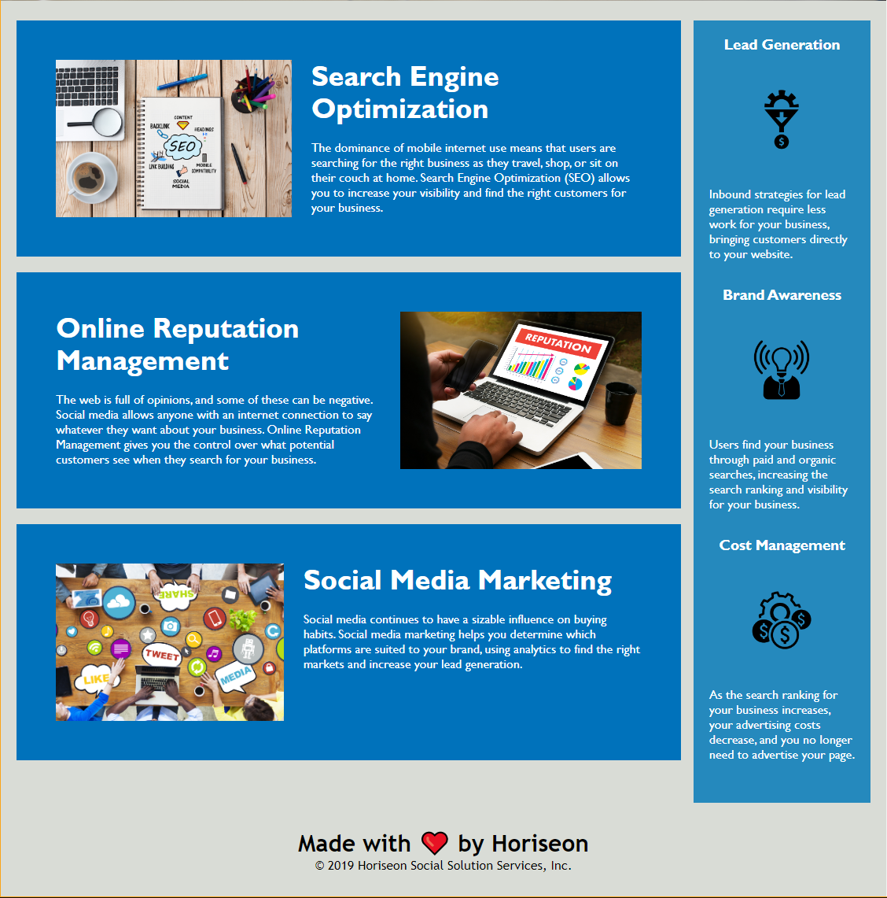

# Hoeriseon Accessibility Refactor

## Description
Code refactor can occur at various times during the development life cycle but generally before introducing major updates or product extensions to include post-launch. In the process of hitting milestones and deadlines, developers may leave dirty code because it works - don't fix whats not broken. However, the dirty code will need to be cleaned up to make extensibliity easier.

This project is intended to make a client's site accessible to those using assistive browsing technologies. The purpose of this project is to get initial exposure to refactoring existing code. The main goal was to introduce alternative descriptions for any referenced images to make the site more accessible and to fix, if any, broken links. The second goal was to dry up the code by consolidating and removing redundancy while also maintaining the sites current visual appearance and integrity.

Deployed Project: https://decourtney.github.io/01-horiseon-accessibility-refactor/

 
    
  
           
          
    

 

## Installation

N/A

## Usage

Reviewing the HTML and CSS files should show that all linked images have an alternative description. Discription comments separating code sections should be visible and relevant. Modified code sections should have short discriptive comments to explain reasons for modifications.

## Credits

N/A

## License

MIT License

Copyright (c) 2022 decourtney

Permission is hereby granted, free of charge, to any person obtaining a copy
of this software and associated documentation files (the "Software"), to deal
in the Software without restriction, including without limitation the rights
to use, copy, modify, merge, publish, distribute, sublicense, and/or sell
copies of the Software, and to permit persons to whom the Software is
furnished to do so, subject to the following conditions:

The above copyright notice and this permission notice shall be included in all
copies or substantial portions of the Software.

THE SOFTWARE IS PROVIDED "AS IS", WITHOUT WARRANTY OF ANY KIND, EXPRESS OR
IMPLIED, INCLUDING BUT NOT LIMITED TO THE WARRANTIES OF MERCHANTABILITY,
FITNESS FOR A PARTICULAR PURPOSE AND NONINFRINGEMENT. IN NO EVENT SHALL THE
AUTHORS OR COPYRIGHT HOLDERS BE LIABLE FOR ANY CLAIM, DAMAGES OR OTHER
LIABILITY, WHETHER IN AN ACTION OF CONTRACT, TORT OR OTHERWISE, ARISING FROM,
OUT OF OR IN CONNECTION WITH THE SOFTWARE OR THE USE OR OTHER DEALINGS IN THE
SOFTWARE.